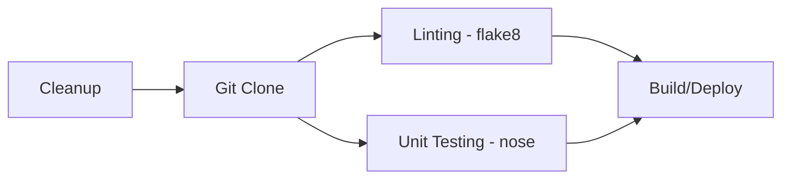
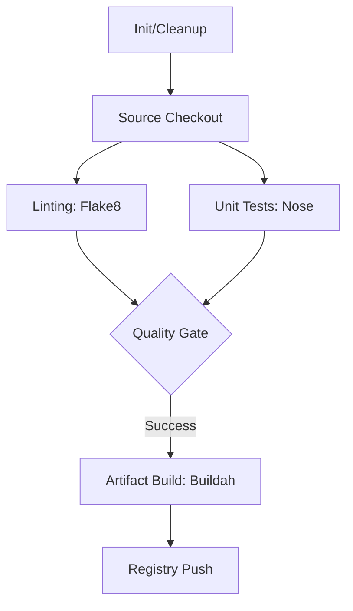

# Enterprise DevOps Workflow: Git Strategy & Automated CI/CD

> **Professional implementation of a robust software development lifecycle (SDLC) focusing on the Feature Branch Workflow and Pipeline-as-Code automation.**

---

## 🏛 Project Overview
This repository serves as a technical showcase for modern **DevOps methodologies**. It transitions from basic version control to a professional **Feature Branch Workflow**, integrating automated quality gates and **Continuous Integration (CI)**. 

The goal is to simulate a production-grade environment where code reliability, non-linear collaboration, and automated validation are the primary drivers of delivery.

## 🛠 Tech Stack
*   **Version Control:** Git (Distributed SCM)
*   **Platform:** GitHub
*   **CI/CD Engine:** GitHub Actions (Primary), with comparative analysis of Jenkins, CircleCI, and Travis CI.
*   **Automation Languages:** YAML (GitHub Actions, CircleCI), Groovy (Jenkins).
*   **Quality Gates:** PyTest (Unit Testing), Flake8/Pylint (Linting), Codecov (Coverage Tracking).

---

## 🔄 Git Strategy: Feature Branch Workflow
I implement a strict **Feature Branch Workflow** to ensure the `main` branch remains deployable at all times.

### 1. Development Lifecycle
1.  **Sync:** Always start from the latest production code.
    ```bash
    git checkout main
    git pull origin main
    ```
2.  **Isolate:** Create a dedicated feature branch using professional naming conventions (`feature/short-description`).
    ```bash
    git checkout -b feature/api-authentication-layer
    ```
3.  **Iterate:** Frequent local commits to create granular checkpoints.
4.  **Staging:** Selective staging using `git add <file>` to maintain a clean commit history.
5.  **Push:** Establish an upstream tracking branch for remote collaboration.
    ```bash
    git push -u origin feature/api-authentication-layer
    ```

### 2. Conflict Resolution & Syncing
Before initiating a Pull Request, the feature branch is re-synchronized with `main` to resolve conflicts locally:
```bash
git checkout main
git pull
git checkout feature/api-authentication-layer
git merge main
# Resolve conflicts manually if they exist

```

### 3. Pull Request (PR) & Social Coding

-   **Review:** Code is subjected to peer review and automated status checks.
    
-   **Merge:** Once approved and CI passes, code is merged into `main`.
    
-   **Cleanup:** Post-merge, the local and remote feature branches are pruned to prevent "repository bloat."
    

----------

## 🚀 Continuous Integration (CI) Logic

The repository leverages **Pipeline-as-Code** to automate the validation process. Every push triggers a high-fidelity workflow.

### Automated Pipeline Stages

**Stage**

**Description**

**Tooling**

**Linting**

Enforces PEP8/Industry standards for code readability.

Flake8 / Pylint

**Unit Testing**

Validates logic via automated test suites.

PyTest

**Dependency Audit**

Checks for vulnerabilities in third-party packages.

Safety / Pip-audit

**Build**

Validates that the application compiles in a Docker container.

Docker

### Comparative Tooling Analysis

While this project prioritizes **GitHub Actions** for native integration, it acknowledges the enterprise landscape:

-   **Jenkins:** Highly customizable via Groovy and a vast plugin ecosystem; requires self-hosting.
    
-   **CircleCI/Travis CI:** SaaS-based YAML configurations optimized for speed and Docker-native builds.
    
-   **GitHub Actions:** Seamlessly integrated with the SCM, allowing for event-driven automation (PRs, Issues, Releases).
    

----------

## 🛡 Advanced Git Operations (Engineering Safety)

-   **`git reset --soft`**: Used to undo a commit while keeping changes staged—perfect for fixing commit messages or small omissions without losing work.
    
-   **`git reset --hard`**: A destructive command used only in specific recovery scenarios to align the local workspace with a known stable commit.
    
-   **`.gitignore` Management**: Strict exclusion of environment variables (`.env`), build artifacts, and OS-specific files to prevent sensitive data leaks.
    

----------

## 📈 Key Outcomes

-   **Zero-Downtime Collaboration:** Mastered the ability to work on complex features without disrupting the main codebase.
    
-   **Automated Quality Assurance:** Reduced human error by shifting testing "left" in the development cycle.
    
-   **Pipeline Portability:** Developed an understanding of multi-CI tool configurations (YAML/Groovy).


---


# ⚙️ Continuous Integration Architecture: GitHub Actions

  

This repository contains the infrastructure-as-code definitions for our Continuous Integration (CI) pipeline. We utilize **GitHub Actions** to automate our build and integration testing processes. By treating our CI pipeline as code, we ensure reproducibility, scalability, and seamless integration within our version control system.

---

## 🏗️ Architecture Overview

GitHub Actions processes workflow files located in the `.github/workflows` directory. There are no external webhooks to configure or third-party platforms to authenticate for basic CI operations; the execution is entirely event-driven and native to the repository.

> **Note:** Before writing custom shell scripts for pipeline steps, always verify the [GitHub Actions Marketplace](https://github.com/marketplace?type=actions) to leverage pre-existing, community-tested modular actions.

### Core Components

| Component | Definition | Implementation Scope |
| :--- | :--- | :--- |
| **Workflow** | An automated procedure added to the repository. | Defines the entire CI process (e.g., `workflow.yml`). |
| **Event** | A specific activity that triggers the workflow. | `push` and `pull_request` targeting `main`. |
| **Runner** | The server that executes the workflow jobs. | Standard `ubuntu-latest` virtual environment. |
| **Container** | Isolated environment inside the runner. | `python:3.9-slim` to ensure dependency consistency. |
| **Job** | A set of steps executed on the same runner. | `build` job containing checkout, lint, and test steps. |

---

## 🔐 Prerequisites & Authentication

To interact with the repository and trigger remote pipeline executions via the CLI, you must generate a GitHub Personal Access Token (PAT).

### Security Checklist
- [x] Navigate to **GitHub Settings > Developer Settings > Personal access tokens**.
- [x] Click **Generate new token**.
- [ ] Assign the token a descriptive name (e.g., `cli-pipeline-access`).
- [ ] Select the mandatory minimum scopes: `repo`, `read:org`, and `workflow`.
- [ ] **Securely store the token** in your local secrets manager. It will not be displayed again.

---

## 💻 Local Development Setup

To test and contribute to the pipeline configuration locally, initialize your environment using the GitHub CLI (`gh`).

### 1. Install Dependencies
```bash
# Update package lists and install GitHub CLI
sudo apt update
sudo apt install gh -y

```

### 2. Authenticate

Bash

```
# Login using the PAT generated in the prerequisite phase
gh auth login

```

### 3. Clone Repository

Bash

```
# Clone the infrastructure repository to your local workspace
gh repo clone <organization>/<repository-name>
cd <repository-name>

# Optional: Shorten your bash prompt for cleaner terminal output
export PS1="[\[\033[01;32m\]\u\[\033[00m\]: \[\033[01;34m\]\W\[\033[00m\]]\$ "

```

----------

## ⚙️ Workflow Implementation

Our primary continuous integration pipeline is defined in `.github/workflows/workflow.yml`. It is designed to maintain parity with our production environment by utilizing a localized Docker container (`python:3.9-slim`) inside the Ubuntu runner.

### `workflow.yml`

YAML

```
name: CI workflow

# ---------------------------------------------------------
# Event Definitions
# Triggers the pipeline on code mutations to the main branch
# ---------------------------------------------------------
on:
  push:
    branches: [ "main" ]
  pull_request:
    branches: [ "main" ]

# ---------------------------------------------------------
# Job Specifications
# ---------------------------------------------------------
jobs:
  build:
    # Execution Environment
    runs-on: ubuntu-latest
    
    # Target Architecture Environment
    # Ensures consistency with Python 3.9 deployments
    container: python:3.9-slim
    
    # Steps will be defined in subsequent iterations
    # steps:
    #   - uses: actions/checkout@v3
    #   ...

```

----------

## 🚀 Deployment & Versioning

Once you have configured or modified the pipeline YAML, commit the infrastructure changes back to the remote repository. The GitHub Actions engine will automatically intercept the `push` event and instantiate the runner.

Bash

```
# 1. Configure local Git identities (if not already set globally)
git config --global user.email "engineer@company.com"
git config --global user.name "DevOps Engineer"

# 2. Stage the pipeline configuration
git add .github/workflows/workflow.yml

# 3. Commit with standard conventional formatting
git commit -m "ci: initialize base workflow with python 3.9 container"

# 4. Push upstream to trigger the GitHub Actions event
git push origin main
```


---


# 🚀 Enterprise CI Pipeline: GitHub Actions Implementation

   

> **Architecture Overview:** This repository contains the reference implementation for a cloud-native Continuous Integration (CI) pipeline using GitHub Actions. It automates the checkout, dependency provisioning, static code analysis (linting), and isolated unit testing of Python-based microservices.

---

## 🏗 Core Architecture

The CI pipeline is defined as a YAML-based workflow inside the `.github/workflows/` directory. It is engineered to trigger automatically, executing in ephemeral, isolated environments to guarantee reproducible builds.

| Component | Description | Enterprise Use-Case Example |
| :--- | :--- | :--- |
| **Event** | The webhook trigger activating the workflow. | `push` or `pull_request` to `main` branch. |
| **Job** | A distinct set of parallel or sequential steps. | `build`, `security_scan`, `publish_image`. |
| **Runner** | The host server/VM executing the job. | `ubuntu-latest`, `windows-server`, self-hosted. |
| **Container** | (Optional) The execution environment on the runner. | `python:3.9-slim` ensuring dev/prod parity. |
| **Service** | Background daemon/database containers. | `redis:6-alpine` or `postgres` for integration tests. |
| **Step** | Individual shell commands or pre-built Actions. | `run: make test` or `uses: actions/checkout@v3`. |

---

## ⚙️ Workflow Components

### 1. Events (Triggers)
Pipelines are event-driven. The most common enterprise triggers include:
- `push`: Triggered on code merges (e.g., CI/CD triggers on `main`).
- `pull_request`: Triggered during code reviews to validate incoming changes.
- `release`: Triggered when publishing artifacts (e.g., pushing to Docker Hub or PyPI).

### 2. Jobs & Dependencies
By default, jobs run in **parallel** to reduce pipeline duration. However, deterministic execution can be enforced using the `needs` keyword.
```yaml
jobs:
  build:
    runs-on: ubuntu-latest
  publish:
    needs: build # Enforces sequential execution
    runs-on: ubuntu-latest

```

----------

## 🛠 Pipeline Specifications

Below is the production-grade `ci.yml` pipeline combining application testing, static analysis, and an ephemeral Redis service for integration checks.

YAML

```
name: Microservice CI Pipeline

on:
  push:
    branches: [ "main" ]
  pull_request:
    branches: [ "main" ]

jobs:
  build_and_test:
    name: Build & Test Microservice
    runs-on: ubuntu-latest
    container: python:3.9-slim
    
    # Defining required infrastructure services for tests
    services:
      redis:
        image: redis:6-alpine
        ports:
          - 6379:6379

    steps:
      - name: 📥 Source Code Checkout
        uses: actions/checkout@v3

      - name: 📦 Provision Dependencies
        run: |
          python -m pip install --upgrade pip
          pip install -r requirements.txt

      - name: 🔍 Static Code Analysis (flake8)
        run: |
          # Check for critical syntax/compilation errors
          flake8 service --count --select=E9,F63,F7,F82 --show-source --statistics
          # Enforce complexity and styling standards
          flake8 service --count --max-complexity=10 --max-line-length=127 --statistics

      - name: 🧪 Unit Testing & Coverage (nose)
        env:
          DATABASE_URI: redis://redis:6379  # 12-factor app environment configuration
        run: |
          nosetests -v --with-spec --spec-color --with-coverage --cover-package=app

```

----------

## 💻 Prerequisites & CLI Setup

To interact with GitHub Actions from your local terminal and test triggers manually, ensure your local environment is configured.

### Local Development Checklist

-   [x] GitHub Account with PAT (Personal Access Token) configured.
    
-   [x] Standard CLI tools (Git, Bash/Zsh).
    
-   [x] GitHub CLI (`gh`) installed.
    

### Setup Instructions

Bash

```
# 1. Update package lists and install GitHub CLI (Debian/Ubuntu)
sudo apt update && sudo apt install gh -y

# 2. Authenticate the CLI with your GitHub workspace
gh auth login

# 3. Configure Git Identity
git config --global user.email "devops@yourcompany.com"
git config --global user.name "Platform Engineering"

```

----------

## 🚀 Implementation Guide

1.  **Initialize the Workflow Directory:** If it does not exist, create the workflow directory at the repository root:
    
    Bash
    
    ```
    mkdir -p .github/workflows
    
    ```
    
2.  **Commit the Pipeline Configuration:** Save the YAML configuration as `.github/workflows/ci.yml`.
    
3.  **Trigger the Pipeline:** Push the code to the remote repository to trigger the event listener.
    
    Bash
    
    ```
    git add .github/workflows/ci.yml
    git commit -m "ci: implement initial build and test pipeline"
    git push origin main
    
    ```
    
4.  **Monitor Execution:** Navigate to the **Actions** tab in the GitHub UI. Inspect the logs for individual steps:
    
    -   Expand `Static Code Analysis (flake8)` to view linter outputs.
        
    -   Expand `Unit Testing & Coverage` to view the Red/Green refactor status and coverage percentages.
        

----------

## 🛡 Best Practices

> **Always check the GitHub Actions Marketplace:** Before writing custom shell scripts for complex deployment or integration tasks, verify if an officially maintained action exists (e.g., `actions/checkout`, code coverage uploaders, AWS/GCP authenticators).

-   **Pin Action Versions:** Always use specific tags (e.g., `@v3`) to prevent breaking changes in upstream actions.
    
-   **Environment Variables:** Adhere to the 12-factor app methodology. Inject dynamic configuration like `DATABASE_URI` via the `env:` block.
    
-   **Isolated Containers:** When possible, run jobs inside explicit Docker containers (`container: python:3.9-slim`) to eliminate runner-level discrepancies and ensure "works on my machine" translates perfectly to "works in the pipeline."


---


# Engineering Excellence: Continuous Delivery (CD) Fundamentals

This repository contains professional documentation and architectural insights into **Continuous Delivery (CD)**. It shifts the focus from academic exercises to production-grade engineering standards, emphasizing automation, reliability, and the "Shift-Left" security philosophy.

---

## 📌 Executive Overview
Continuous Delivery is a software development discipline where software is built such that it can be **released to production at any time**. It moves beyond simple integration, ensuring that the transition from code-complete to user-ready is automated, safe, and repeatable.

### Learning Objectives
*   **Architectural Distinction:** Decouple CI, CD, and Continuous Deployment.
*   **Process Optimization:** Implement small-batch delivery and trunk-based development.
*   **Tooling Strategy:** Evaluate Cloud-Native tools like **Tekton** and **ArgoCD**.
*   **Security Integration:** Embed SAST, DAST, and secret scanning into the lifecycle.

---

## 🔄 The Lifecycle: CI vs. CD vs. Continuous Deployment

Understanding the pipeline flow is critical. While often grouped as "CI/CD," they represent distinct stages in the Software Development Lifecycle (SDLC).

| Concept | Focus | Outcome |
| :--- | :--- | :--- |
| **Continuous Integration (CI)** | Merging code to the main branch frequently. | Verified build & passing unit tests. |
| **Continuous Delivery (CD)** | Automating the path to production-like environments. | A "Deployable" artifact in Staging/UAT. |
| **Continuous Deployment** | Fully automated release to end-users. | Code live in Production without manual gate. |

> "Continuous Delivery is about making releases boring. It should be a non-event that happens at the click of a button or an automated trigger."

---

## 🏛️ The 5 Key Principles of CD

To maintain a high-velocity engineering team, these principles must be treated as non-negotiable:

1.  **Build Quality In:** Every Pull Request (PR) is an automated quality gate. Stop the line if a build fails.
2.  **Work in Small Batches:** Reduce risk by deploying smaller units of change. This simplifies debugging and rollback procedures.
3.  **Automate Repetitive Tasks:** If a human has to do it twice, a computer should do it forever. Use tools like **GitHub Actions** or **Tekton**.
4.  **Relentless Continuous Improvement:** Treat the pipeline itself as a product. Iterate on deployment speed and failure rates.
5.  **Collective Responsibility:** "You build it, you run it." Focus on systemic failures over individual blame.


---

## 🛠️ Engineering Best Practices & Architecture

### 1. Trunk-Based Development
Avoid long-lived feature branches. Merge to `main` daily to prevent "merge hell" and ensure the codebase remains in a releasable state.

### 2. Environment Parity
Ensure Development, Testing, and Staging environments mirror Production as closely as possible. This minimizes "it works on my machine" syndrome.

### 3. Pipeline Components
A production-grade CD pipeline requires:
- [ ] **Source of Truth:** Git (GitHub/GitLab).
- [ ] **Build Server:** Ephemeral environments for clean builds.
- [ ] **Artifact Repository:** (e.g., JFrog Artifactory, GHCR) to store immutable binaries/images.
- [ ] **Orchestrator:** To manage the flow between stages (Tekton/ArgoCD).

---

## 🛡️ DevSecOps: Shifting Security Left
Security must not be an afterthought. Integrating these automated checks ensures compliance without slowing down delivery:

*   **Secret Scanning:** Prevent API keys or credentials from leaking into version control.
*   **SAST (Static Analysis):** Scans source code for SQL injections and vulnerabilities before execution.
*   **DAST (Dynamic Analysis):** Tests the running application for security flaws.
*   **Vulnerability Scanning:** Identifies CVEs in third-party libraries and container images.

---

## 🧰 The Tooling Ecosystem

Choosing the right tool depends on the infrastructure (VMs vs. Kubernetes).

### Cloud-Native Powerhouses
*   **Tekton:** A powerful, Kubernetes-native framework for creating CI/CD systems. It provides modular, portable pipelines that can be reused across the organization.
*   **ArgoCD:** A declarative, GitOps-based CD tool for Kubernetes. It ensures the "Live State" of your cluster matches the "Desired State" in Git.

### Comparison Table
| Tool | Strength | Best For |
| :--- | :--- | :--- |
| **Jenkins** | Massive plugin library | Legacy systems & complex logic |
| **GitLab CI** | All-in-one platform | Teams wanting a unified experience |
| **Spinnaker** | Advanced deployment (Blue/Green) | Multi-cloud, large-scale deployments |
| **Tekton** | Modularity & K8s Native | Standardizing reusable pipelines |


---


# 🚀 Tekton CI/CD Pipeline Implementation

> Enterprise-grade Continuous Integration and Continuous Delivery (CI/CD) pipeline utilizing Tekton native Kubernetes resources.

This repository contains the declarative Kubernetes manifests required to provision and run a fully automated CI/CD pipeline. The pipeline currently supports automated code checkout, syntax linting (Flake8), unit testing (PyUnit), container image building, and deployment mapping.

---

## 🏗️ Architecture & Pipeline Stages

The pipeline is designed with a decoupled architecture, utilizing standalone Tekton `Task` resources that are sequentially orchestrated via a `Pipeline` resource.

| Stage | Task Name | Container Image | Description |
| :--- | :--- | :--- | :--- |
| **1. Source Control** | `checkout` | `bitnami/git:latest` | Clones the target branch from the remote Git repository. |
| **2. Code Quality** | `lint` | `alpine:3` *(mock)* | Executes Flake8 to ensure PEP-8 compliance and catch syntax anomalies. |
| **3. Unit Testing** | `tests` | `alpine:3` *(mock)* | Runs PyUnit test suites to validate application logic. |
| **4. Artifact Build** | `build` | `alpine:3` *(mock)* | Compiles the source and builds the Docker container image. |
| **5. Deployment** | `deploy` | `alpine:3` *(mock)* | Deploys the containerized artifact to the staging/production environment. |

*Note: Stages 2 through 5 are currently utilizing an `echo` dry-run task for structural validation and logging. These will be replaced with specific build/deploy container images (e.g., Kaniko, Helm) in upcoming releases.*

---

## ⚙️ Parameters

The pipeline is fully parameterized to support dynamic runtime execution across different repositories and branches.

| Parameter | Type | Default | Description |
| :--- | :--- | :--- | :--- |
| `repo-url` | `string` | *None (Required)* | The HTTPS/SSH URL of the remote Git repository to clone. |
| `branch` | `string` | `master` | The target branch to checkout and build (e.g., `main`, `develop`). |
| `message` | `string` | *None* | Used internally by the utility `echo` task for diagnostic logging. |

---

## 📁 Project Structure

```text
.
├── tasks/
│   ├── echo.yaml        # Utility task for logging/mocking steps
│   └── checkout.yaml    # Task handling Git operations via bitnami/git
├── pipelines/
│   ├── cd-pipeline.yaml # Main orchestration pipeline 
└── README.md
```

---

## 🚀 Prerequisites

Ensure your environment meets the following requirements before applying the manifests:

- [x] Running Kubernetes Cluster (v1.18 or higher)
- [x] Tekton Pipelines controller installed (`tekton.dev/v1beta1`)
- [ ] `kubectl` CLI configured with cluster access
- [ ] Tekton CLI (`tkn`) installed locally for triggering pipeline runs

---

## 💻 Deployment & Usage

### 1. Apply Task Manifests
First, provision the foundational Tekton Tasks (`checkout` and `echo`) into your Kubernetes cluster.

```bash
kubectl apply -f tasks/echo.yaml
kubectl apply -f tasks/checkout.yaml
```

**Checkout Task Example (`checkout.yaml`):**
```yaml
apiVersion: tekton.dev/v1beta1
kind: Task
metadata:
  name: checkout
spec:
  params:
    - name: repo-url
      description: The URL of the git repo to clone
      type: string
    - name: branch
      description: The branch to clone
      type: string
  steps:
    - name: checkout
      image: bitnami/git:latest
      command: [git]
      args: ["clone", "--branch", "$(params.branch)", "$(params.repo-url)"]
```

### 2. Apply Pipeline Manifest
Next, apply the `cd-pipeline` definition which orchestrates the tasks sequentially using `runAfter` directives.

```bash
kubectl apply -f pipelines/cd-pipeline.yaml
```

### 3. Trigger a PipelineRun
Use the Tekton CLI to instantiate a `PipelineRun`. This dynamically provisions the execution Pods and passes your specific parameters into the workflow.

```bash
tkn pipeline start cd-pipeline \
    --showlog \
    -p repo-url="[https://github.com/your-org/your-microservice.git](https://github.com/your-org/your-microservice.git)" \
    -p branch="main"
```

### 4. Verify Execution
If successful, you will see real-time streaming logs as each container provisions and executes its command:

```text
PipelineRun started: cd-pipeline-run-wvfzx
Waiting for logs to be available...
[clone : checkout] Cloning into 'your-microservice'...
[lint : echo-message] Calling Flake8 linter...
[tests : echo-message] Running unit tests with PyUnit...
[build : echo-message] Building image for [https://github.com/your-org/your-microservice.git](https://github.com/your-org/your-microservice.git) ...
[deploy : echo-message] Deploying main branch of [https://github.com/your-org/your-microservice.git](https://github.com/your-org/your-microservice.git) ...
```

---

# 🚀 Tekton Automated CI/CD: GitHub Webhook Triggers

> **Infrastructure as Code (IaC) Reference** > Enterprise-grade event-driven pipeline execution using Tekton Triggers. This repository contains the Kubernetes manifests required to automate CI/CD workflows by listening to external GitHub webhook events.

---

## 📌 Architecture Overview

This deployment leverages **Tekton Triggers** to bridge external Git operations (e.g., pushes, pull requests) with internal cluster deployments. By abstracting the event handling, we maintain a decoupled, scalable CI/CD architecture.

### Trigger Flow Lifecycle

The system processes incoming events through three distinct Custom Resource Definitions (CRDs):

| Sequence | Component | Function in Architecture |
| :---: | :--- | :--- |
| **1** | 🎧 `EventListener` | An active Kubernetes Pod that exposes an endpoint to capture external HTTP JSON payloads (e.g., GitHub Webhooks). |
| **2** | 🔗 `TriggerBinding` | Acts as the data extraction layer. It parses the incoming JSON body and maps specific fields to internal variables. |
| **3** | ⚙️ `TriggerTemplate` | The instantiation layer. It ingests the mapped variables and dynamically generates a `PipelineRun` resource. |
| **4** | 🚀 `PipelineRun` | The actual execution engine that triggers the defined CI/CD pipeline tasks. |

---

## 📋 Prerequisites

Ensure your cluster meets the following operational requirements before deploying:

- [x] **Kubernetes Cluster** (v1.22+ recommended)
- [x] **Tekton Pipelines** installed and operational
- [x] **Tekton Triggers** installed and operational
- [x] Dedicated `pipeline` **ServiceAccount** configured with RBAC permissions
- [x] Required CLI Tools: `kubectl` and `tkn`

> **Note:** This setup assumes a pre-existing `cd-pipeline` alongside `checkout` and `echo` tasks in your target namespace.

---

## 🛠️ Infrastructure Manifests

### 1. EventListener (`eventlistener.yaml`)
Deploys the service endpoint that listens for GitHub webhook events and routes them to the configured bindings and templates.

```yaml
apiVersion: triggers.tekton.dev/v1beta1
kind: EventListener
metadata:
  name: cd-listener
  labels:
    app.kubernetes.io/managed-by: tekton-triggers
spec:
  serviceAccountName: pipeline
  triggers:
    - bindings:
        - ref: cd-binding
      template:
        ref: cd-template

```

### 2. TriggerBinding (`triggerbinding.yaml`)

Extracts the repository URL and git reference (branch) dynamically from the GitHub event payload.

YAML

```
apiVersion: triggers.tekton.dev/v1beta1
kind: TriggerBinding
metadata:
  name: cd-binding
spec:
  params:
    - name: repository
      value: $(body.repository.url)
    - name: branch
      value: $(body.ref)

```

### 3. TriggerTemplate (`triggertemplate.yaml`)

Receives parameters from the binding and generates a unique `PipelineRun` to execute the integration and deployment steps.

YAML

```
apiVersion: triggers.tekton.dev/v1beta1
kind: TriggerTemplate
metadata:
  name: cd-template
spec:
  params:
    - name: repository
      description: "Target Git Repository URL"
      default: ""
    - name: branch
      description: "Target Git Branch"
      default: "master"
  resourcetemplates:
    - apiVersion: tekton.dev/v1beta1
      kind: PipelineRun
      metadata:
        generateName: cd-pipeline-run-
      spec:
        serviceAccountName: pipeline
        pipelineRef:
          name: cd-pipeline
        params:
          - name: repo-url
            value: $(tt.params.repository)
          - name: branch
            value: $(tt.params.branch)

```

----------

## 🚀 Deployment & Testing Guide

### Step 1: Apply Configurations

Apply the trigger manifests to your Kubernetes cluster:

Bash

```
kubectl apply -f triggerbinding.yaml
kubectl apply -f triggertemplate.yaml
kubectl apply -f eventlistener.yaml

```

Verify the EventListener pod is running and accessible:

Bash

```
tkn eventlistener ls

```

### Step 2: Local Traffic Routing (Port-Forwarding)

To test the webhook locally without exposing an Ingress controller, bind the `EventListener` service to your localhost:

Bash

```
kubectl port-forward service/el-cd-listener 8090:8080

```

_(Leave this terminal session running)_

### Step 3: Simulate GitHub Webhook Payload

In a new terminal window, use `curl` to send a mock GitHub push event to the listener.

Bash

```
curl -X POST http://localhost:8090 \
  -H 'Content-Type: application/json' \
  -d '{
        "ref": "main",
        "repository": {
          "url": "[https://github.com/your-org/backend-api-service](https://github.com/your-org/backend-api-service)"
        }
      }'

```

### Step 4: Monitor Pipeline Execution

Track the dynamically generated PipelineRun using the Tekton CLI:

Bash

```
# View active pipeline runs
tkn pipelinerun ls

# Stream logs for the latest execution
tkn pipelinerun logs --last -f

```

----------

## 📊 Pipeline Execution Stages

Upon successful trigger, the pipeline progresses through the following standard DevOps phases:

1.  **`[clone]`** - Pulls source code from the bound repository.
    
2.  **`[lint]`** - Static code analysis (e.g., Flake8).
    
3.  **`[tests]`** - Executes unit testing suites (e.g., PyUnit).
    
4.  **`[build]`** - Compiles artifacts and builds the OCI-compliant container image.
    
5.  **`[deploy]`** - Pushes updates to the target Kubernetes environment.

---


# 🚀 Leveraging the Tekton Catalog for Enterprise CI/CD

> **The DevOps Golden Rule:** *A line of code you didn’t write is a line of code you don't have to maintain.* 

Welcome to the technical guide on integrating the **Tekton Catalog (Tekton Hub)** into your Kubernetes-native CI/CD workflows. Rather than reinventing the wheel by writing custom automation scripts, modern DevOps practices dictate leveraging community-validated, reusable tasks. 

This guide will walk you through replacing a rudimentary custom task with a robust, community-supported `git-clone` task, and implementing **Workspaces** via PersistentVolumeClaims (PVCs) for cross-pod data sharing.


---

## 📑 Table of Contents
1. [Core Concepts](#-core-concepts)
2. [Prerequisites](#-prerequisites)
3. [Implementation Guide](#-implementation-guide)
   - [1. Add the Task](#step-1-add-the-git-clone-task-from-the-catalog)
   - [2. Provision a Workspace](#step-2-provision-a-workspace-pvc)
   - [3. Pipeline Integration](#step-3-integrate-the-workspace-into-your-pipeline)
   - [4. Execution & Monitoring](#step-4-execute-and-monitor-the-pipeline)
4. [Best Practices](#-devops-best-practices)

---

## 🧠 Core Concepts

### Tekton Catalog (Hub)
The [Tekton Hub](https://hub.tekton.dev) is a centralized repository of pre-built, reusable Tekton tasks. Utilizing these tasks saves engineering hours on creation, debugging, and long-term maintenance. 

| Feature | Custom "In-House" Tasks | Catalog Tasks |
| :--- | :--- | :--- |
| **Maintenance** | High (Requires dedicated team effort) | Low (Community maintained) |
| **Reliability** | Variable | High (Tested across diverse environments) |
| **Features** | Usually limited to immediate needs | Extensive (Rich parameter sets, edge-case handling) |

### Workspaces
Because each Tekton Task executes in its own isolated Kubernetes Pod, transferring artifacts (like cloned source code) between tasks requires shared storage. 
**Workspaces** solve this by mapping a Kubernetes `PersistentVolumeClaim` (PVC) into the pods, providing a shared filesystem for your build artifacts.


---

## 📋 Prerequisites

Before deploying the pipeline infrastructure, ensure your environment is prepped:

- [x] Active Kubernetes Cluster (e.g., Minikube, EKS, AKS, or GKE)
- [x] `kubectl` CLI installed and authenticated
- [x] Tekton Pipelines installed on the cluster
- [x] `tkn` CLI installed
- [x] Base tasks applied (`kubectl apply -f tasks.yaml` from previous modules)

---

## 🛠️ Implementation Guide

### Step 1: Add the `git-clone` Task from the Catalog

We are replacing our rudimentary `checkout` task with the official `git-clone` task. You can pull this directly from the upstream repository.

**Option A: Apply via Raw Manifest (Recommended for Automation)**
```bash
kubectl apply -f [https://raw.githubusercontent.com/tektoncd/catalog/main/task/git-clone/0.9/git-clone.yaml](https://raw.githubusercontent.com/tektoncd/catalog/main/task/git-clone/0.9/git-clone.yaml)
```

**Verify the Installation:**
```bash
kubectl get task git-clone
```

### Step 2: Provision a Workspace (PVC)

The `git-clone` task requires a workspace to output the cloned code. We will provision a PVC to act as this shared volume.

Create a file named `pvc.yaml`:
```yaml
apiVersion: v1
kind: PersistentVolumeClaim
metadata:
  name: pipelinerun-pvc
spec:
  # Adjust storageClassName based on your cluster's provisioner (e.g., standard, gp2)
  storageClassName: skills-network-learner 
  resources:
    requests:
      storage: 1Gi
  volumeMode: Filesystem
  accessModes:
    - ReadWriteOnce
```

Apply the infrastructure:
```bash
kubectl apply -f pvc.yaml
```

### Step 3: Integrate the Workspace into Your Pipeline

Next, we refactor `pipeline.yaml`. We need to declare the workspace at the pipeline level and map it down to the `git-clone` task. We also map the required parameters (`url` and `revision`).
```yaml
apiVersion: tekton.dev/v1beta1
kind: Pipeline
metadata:
  name: cd-pipeline
spec:
  # 1. Declare the workspace for the entire pipeline
  workspaces:
    - name: pipeline-workspace
  params:
    - name: repo-url
      type: string
    - name: branch
      default: "main"
      type: string
  tasks:
    - name: clone
      # 2. Map the pipeline workspace to the task's expected "output" workspace
      workspaces:
        - name: output
          workspace: pipeline-workspace
      # 3. Reference the catalog task
      taskRef:
        name: git-clone
      # 4. Map pipeline parameters to task parameters
      params:
      - name: url
        value: $(params.repo-url)
      - name: revision
        value: $(params.branch)

    # (Subsequent tasks like lint, build, deploy remain unchanged)
```

Apply the updated pipeline:
```bash
kubectl apply -f pipeline.yaml
```

### Step 4: Execute and Monitor the Pipeline

Trigger the pipeline using the `tkn` CLI. We pass the repository details and dynamically bind the pipeline's workspace to our PVC.
```bash
tkn pipeline start cd-pipeline \
    -p repo-url="[https://github.com/ibm-developer-skills-network/wtecc-CICD_PracticeCode.git](https://github.com/ibm-developer-skills-network/wtecc-CICD_PracticeCode.git)" \
    -p branch="main" \
    -w name=pipeline-workspace,claimName=pipelinerun-pvc \
    --showlog
```

**Expected Output:**
```text
PipelineRun started: cd-pipeline-run-mndgw
Waiting for logs to be available...
[clone : clone] Cloning [https://github.com/](https://github.com/)... into /workspace/output
[lint : echo-message] Calling Flake8 linter...
[tests : echo-message] Running unit tests with PyUnit...
[build : echo-message] Building image...
[deploy : echo-message] Deploying main branch...
```

You can verify historical runs anytime using:
```bash
tkn pipelinerun ls
tkn pipelinerun logs --last
```

---

## 🛡️ DevOps Best Practices

- **Immutability:** Pin your catalog tasks to specific versions (e.g., `0.9`) rather than `main` to prevent unexpected pipeline breaks during upstream updates.
- **Resource Limits:** Always define storage requests appropriately in your PVCs to avoid exhausting cluster storage during concurrent PipelineRuns.
- **Security:** Review the YAML of catalog tasks before applying them to a production cluster to ensure they don't request overly permissive ServiceAccounts unless necessary.

---


# Tekton CI/CD: Automated Quality Assurance & Unit Testing

This repository contains the implementation details for building a high-performance, cloud-native CI/CD pipeline using **Tekton**. It focuses on automating quality gates through static analysis (linting) and unit testing, leveraging parallel execution and Kubernetes-native configurations.

---

## 🏗 Pipeline Architecture

The pipeline is designed as a linear progression with optimized parallel stages to minimize total execution time. 



> **Engineering Note:** In a production-grade environment, quality checks like linting and unit testing are independent. Running them in parallel utilizes Tekton's concurrency model, significantly reducing the "Feedback Loop" for developers.

----------

## 🛠 Prerequisites & Environment Setup

Before executing the pipeline, ensure the Kubernetes environment is provisioned with the necessary Custom Resource Definitions (CRDs) and storage.

### 1. Establish Infrastructure Components

Apply the baseline tasks and storage requirements:

Bash

```
# Apply common tasks (e.g., echo, custom scripts)
kubectl apply -f tasks.yaml

# Provision PersistentVolumeClaim (PVC) for the shared workspace
kubectl apply -f pvc.yaml

```

### 2. Install Catalog Tasks

Leverage the **Tekton Hub/Catalog** for standard operations like Git integration:

Bash

```
kubectl apply -f [https://raw.githubusercontent.com/tektoncd/catalog/main/task/git-clone/0.9/git-clone.yaml](https://raw.githubusercontent.com/tektoncd/catalog/main/task/git-clone/0.9/git-clone.yaml)
kubectl apply -f [https://raw.githubusercontent.com/tektoncd/catalog/main/task/flake8/0.1/flake8.yaml](https://raw.githubusercontent.com/tektoncd/catalog/main/task/flake8/0.1/flake8.yaml)

```

----------

## 📋 Task Definitions

### 🧹 Workspace Hygiene (The Cleanup Task)

To prevent build contamination between consecutive runs, a cleanup task is executed to purge the workspace. This is critical when dealing with compiled files (`.pyc`) owned by different users.

**Field**

**Configuration**

**Image**

`alpine:3`

**Privileges**

`runAsUser: 0` (Required for recursive deletion)

**Scope**

Deletes hidden and non-hidden files from `$(workspaces.source.path)`

### 🔍 Static Analysis (Linting)

The pipeline utilizes `flake8` to enforce PEP 8 standards.

-   **Image:** `python:3.9-slim`
    
-   **Parameters:** - `max-complexity`: 10
    
    -   `max-line-length`: 127
        
    -   `statistics`: Enabled
        

### 🧪 Automated Unit Testing (Custom Task)

Since a standard `nosetests` task may not exist in the public catalog, we define a custom Task. This demonstrates the "Bring Your Own Script" capability of Tekton.

YAML

```
apiVersion: tekton.dev/v1beta1
kind: Task
metadata:
  name: nose
spec:
  workspaces:
    - name: source
  params:
    - name: args
      type: string
      default: "-v"
  steps:
    - name: nosetests
      image: python:3.9-slim
      workingDir: $(workspaces.source.path)
      script: |
        #!/bin/bash
        set -e
        python -m pip install --upgrade pip wheel
        pip install -r requirements.txt
        nosetests $(params.args)

```

----------

## 🔐 Configuration & Secrets Management

Following the **12-Factor App** methodology (specifically Factor III: Config), all sensitive data such as Database URIs are injected via environment variables.

### Injecting Kubernetes Secrets

To connect tests to a transient Redis instance, we map a Kubernetes Secret to the task environment:

YAML

```
env:
  - name: DATABASE_URI
    valueFrom:
      secretKeyRef:
        name: redis-creds
        key: database_uri

```

----------

## 🚀 Pipeline Execution

To trigger the pipeline, provide the repository coordinates and workspace references via the `tkn` CLI.

### Run Command

Bash

```
tkn pipeline start cd-pipeline \
    -p repo-url="[https://github.com/your-org/practice-code.git](https://github.com/your-org/practice-code.git)" \
    -p branch="main" \
    -w name=pipeline-workspace,claimName=pipelinerun-pvc \
    --showlog

```

### Monitoring

-   **List Runs:** `tkn pipelinerun ls`
    
-   **Inspect Logs:** `tkn pipelinerun logs --last`
    
-   **Task Status:** `tkn task ls`
    

----------

## 💎 Key Engineering Principles Applied

-   [x] **Parallelism:** Concurrently running Lint and Test stages.
    
-   [x] **Idempotency:** Using a cleanup task to ensure a clean slate for every build.
    
-   [x] **Environment Parity:** Using `python:3.9-slim` across development and CI to minimize "it works on my machine" issues.
    
-   [x] **Separation of Concerns:** Defined distinct workspaces for source code handling.
    
-   [x] **Extensibility:** Custom shell scripts wrapped in Kubernetes-native Task YAMLs.

---


# Tekton CI/CD: OCI Image Build & Registry Orchestration

This module focuses on the **Artifact Construction** phase of the CI/CD pipeline. By leveraging **Buildah**, we implement a daemonless, rootless container image build process that transforms validated source code into an OCI-compliant image, followed by an automated push to a secure container registry.

---

## 🏗 Pipeline Workflow & Quality Gates

The pipeline follows a "Fail-Fast" architecture. The **Build** stage is gated behind the successful completion of parallel quality checks (Static Analysis and Unit Testing).


> **Engineer's Note:** We utilize `runAfter` to synchronize the parallel execution of linting and testing. The build process will only trigger if **both** upstream tasks return a zero exit code, ensuring only "clean" code is containerized.

----------

## 🛠 Tooling & Environment Setup

### 1. Task Discovery via Tekton CLI

Rather than manual YAML searching, we utilize the `tkn hub` CLI to identify production-ready tasks.

Bash

```
# Search for OCI-compliant build tasks
tkn hub search build --kinds task

```

**Candidate**

**Tech Stack**

**Use Case**

**buildah**

Project Atomic

Daemonless builds (Best for Kubernetes)

**kaniko**

Google

Build images from Dockerfiles inside K8s

**buildpacks**

Cloud Native

Build without Dockerfiles

### 2. ClusterTask Inventory

In enterprise environments, common tasks are often managed at the cluster level by platform engineers.

Bash

```
# List globally available tasks
tkn clustertask ls

```

----------

## 🔧 Implementation Details

### Pipeline Integration (`pipeline.yaml`)

To integrate the build stage, we define a global `build-image` parameter and reference the `buildah` ClusterTask.

YAML

```
spec:
  params:
    - name: build-image
      description: The fully qualified OCI image destination (registry/repo:tag)
      type: string

  tasks:
    - name: build
      runAfter:
        - lint
        - tests
      workspaces:
        - name: source
          workspace: pipeline-workspace
      taskRef:
        name: buildah
        kind: ClusterTask # Reference cluster-scoped resource
      params:
        - name: IMAGE
          value: $(params.build-image)

```

### Buildah vs. Docker-in-Docker (DinD)

We utilize **Buildah** for this stage because it does not require a Docker daemon or privileged containers, aligning with the **Principle of Least Privilege (PoLP)** in cloud-native security.

----------

## 🚀 Execution & Artifact Promotion

### Triggering the Pipeline

To execute the pipeline and push to the internal OpenShift registry:

Bash

```
# Set registry namespace variable
export REGISTRY_PATH="image-registry.openshift-image-registry.svc:5000/$SN_ICR_NAMESPACE/tekton-lab:latest"

# Execute
tkn pipeline start cd-pipeline \
    -p repo-url="[https://github.com/ibm-developer-skills-network/wtecc-CICD_PracticeCode.git](https://github.com/ibm-developer-skills-network/wtecc-CICD_PracticeCode.git)" \
    -p branch="main" \
    -p build-image=$REGISTRY_PATH \
    -w name=pipeline-workspace,claimName=pipelinerun-pvc \
    --showlog

```

### Observability

Monitor the progress and verify the artifact status:

Bash

```
# Verify PipelineRun status
tkn pipelinerun ls

# Inspect logs of the build container
tkn pipelinerun logs --last -f
```

---


# Kubernetes CD: Automated Deployment with Tekton Pipelines

This repository contains the configuration and documentation for the final stage of a **Continuous Deployment (CD)** pipeline. Moving beyond CI (Continuous Integration), we focus on the automated orchestration of application delivery to **Kubernetes** and **OpenShift** environments using **Tekton** and the **OpenShift CLI (`oc`)**.

---

## 🏗️ Pipeline Overview

The deployment phase represents the final milestone in our automated workflow. The pipeline follows these logical stages:

1.  **Source:** Clone repository from GitHub.
2.  **Lint & Test:** Static analysis via `flake8` and unit testing via `nose`.
3.  **Build:** Containerize the application and push to a private registry.
4.  **Deploy:** Instantiate resources on the cluster using the `openshift-client`.


---

## 🛠️ Prerequisites & Environment Setup

Before executing the deployment task, ensure the environment is initialized with the necessary base tasks and persistent volumes.

### Initialize Core Tasks
```bash
# Navigate to the project workspace
cd /home/project/wtecc-CICD_PracticeCode/labs/06_deploy_to_kubernetes/

# Install the standard Git Clone task from Tekton Hub
kubectl apply -f [https://raw.githubusercontent.com/tektoncd/catalog/main/task/git-clone/0.9/git-clone.yaml](https://raw.githubusercontent.com/tektoncd/catalog/main/task/git-clone/0.9/git-clone.yaml)

# Apply supporting manifests (Tasks, PVCs)
kubectl apply -f tasks.yaml
kubectl apply -f pvc.yaml

```

### Verify Pipeline Readiness

Confirm that all prerequisite tasks are available in the namespace:

Bash

```
tkn task ls

```

----------

## 🚀 Deployment Strategies

We utilize the `openshift-client` task, which acts as a wrapper for `oc`/`kubectl` commands. This allows for two primary deployment methodologies:

### 1. Imperative CLI Deployment (Dynamic)

Best for rapid prototyping or simple deployments where parameters are passed directly to the CLI.

**Pipeline Configuration Snippet:**

YAML

```
- name: deploy
  taskRef:
    name: openshift-client
    kind: ClusterTask
  params:
    - name: SCRIPT
      value: "oc create deploy $(params.app-name) --image=$(params.build-image)"
  runAfter:
    - build

```

### 2. Declarative Manifest Deployment (Production Standard)

The preferred "Infrastructure as Code" (IaC) approach. It utilizes YAML manifests stored in the repository for version-controlled state management.

**Advanced Script Usage:**

YAML

```
params:
  - name: SCRIPT
    value: |
      oc apply -f deploy/
      oc rollout status deployment/$(params.app-name)
      oc get pods -l app=$(params.app-name)
workspaces:
  - name: manifest-dir
    workspace: pipeline-workspace

```

----------

## 🔧 Pipeline Implementation

To integrate the deployment stage, the `pipeline.yaml` must be updated to include the `app-name` parameter and the `deploy` task definition.

### Global Parameters

YAML

```
spec:
  params:
    - name: app-name
      description: The name of the application deployment
    - name: build-image
      description: The fully qualified image URI

```

### Deployment Task (ClusterTask Reference)

> **Note:** Since `openshift-client` is often provided as a `ClusterTask` by administrators, the `kind: ClusterTask` attribute is mandatory for Tekton to locate the resource outside the local namespace.

----------

## 🏁 Execution & Verification

### Triggering the Pipeline

Execute the following command to start the CD process. Replace `$SN_ICR_NAMESPACE` with your specific registry namespace.

Bash

```
tkn pipeline start cd-pipeline \
    -p repo-url="[https://github.com/ibm-developer-skills-network/wtecc-CICD_PracticeCode.git](https://github.com/ibm-developer-skills-network/wtecc-CICD_PracticeCode.git)" \
    -p branch=main \
    -p app-name=hitcounter \
    -p build-image=image-registry.openshift-image-registry.svc:5000/$SN_ICR_NAMESPACE/tekton-lab:latest \
    -w name=pipeline-workspace,claimName=pipelinerun-pvc \
    --showlog
```
